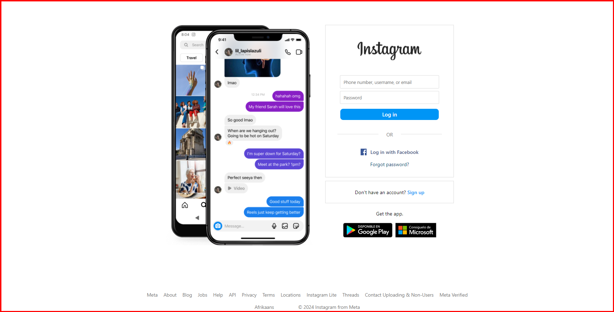

# Proyecto de Simulación de Phishing - Página Frontend

## Descripción

Este proyecto es una simulación de una página de phishing diseñada con fines educativos. El objetivo principal es mostrar cómo pueden ser replicadas páginas legítimas, como la de Instagram, para engañar a los usuarios y robar sus credenciales.

Este proyecto tiene como propósito demostrar cómo un atacante podría usar un diseño visual engañoso y técnicas de ingeniería social para manipular a las personas, además de educar sobre cómo prevenir y detectar estos ataques.

### Características:

-   Réplica del formulario de inicio de sesión de Instagram.
-   Diseño visual similar al sitio web original para fines educativos.
-   No guarda ni captura datos de usuarios. **Este es un proyecto 100% educativo sin ningún componente malicioso.**

## Objetivos Personales

-   [ ] Mejorar mis habilidades en HTML, CSS y JavaScript al replicar una página real.
-   [ ] Entender cómo los ataques de phishing pueden ser visualmente convincentes y cómo protegerse de ellos.
-   [ ] Desarrollar una mejor comprensión sobre la seguridad web y las mejores prácticas de prevención.
-   [ ] Crear un proyecto para mi portfolio que demuestre mis habilidades en diseño web y desarrollo frontend.

## Tecnologías 🔧

**Frontend:**

-   HTML
-   CSS
-   JavaScript
